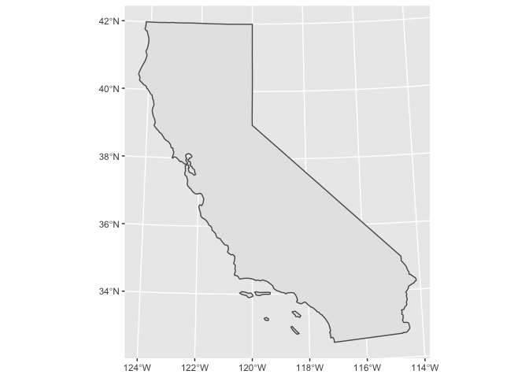
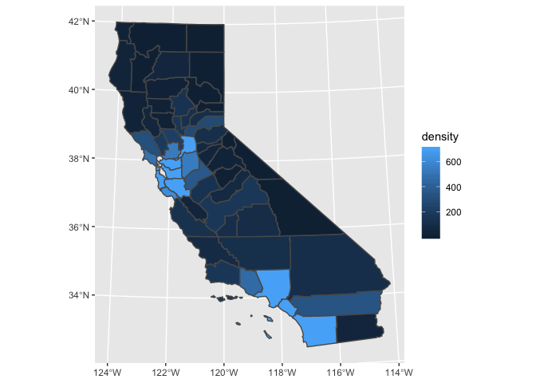
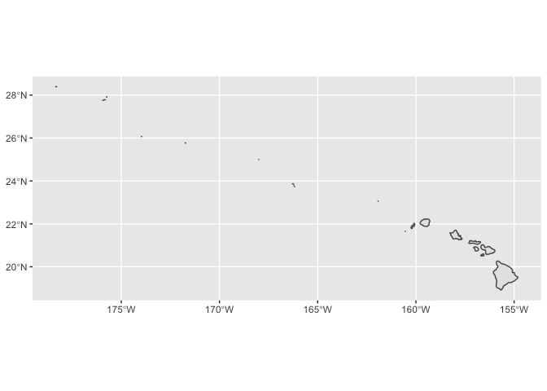

<!-- Generated automatically from spatial-vis.yml. Do not edit by hand -->

# Spatial visualization <small class='visualize'>[visualize]</small>
<small>(Builds on: [Spatial basics](spatial-basics.md))</small>


``` r
library(tidyverse)
library(sf)
```

In Spatial Basics, you learned how to plot spatial data using the
`plot()` function. Now, we’ll show you how to visualize spatial data
using `geom_sf()`. `geom_sf()` has the advantage of being part of
ggplot2, meaning you can layer geoms, use scales functions to change
colors, easily tweak legends, alter the theme, etc.

## `geom_sf()`

The [ussf package](https://github.com/dcl-docs/ussf) makes it easy to
create maps of the U.S. by supplying state, county, or commuting zone
boundaries. Use `geography = "state"` to return boundaries for all U.S.
states.

``` r
states <- ussf::boundaries(geography = "state")

states %>% 
  select(GEOID, NAME, geometry)
#> Simple feature collection with 51 features and 2 fields
#> geometry type:  MULTIPOLYGON
#> dimension:      XY
#> bbox:           xmin: -2358696 ymin: -1338125 xmax: 2258154 ymax: 1558935
#> epsg (SRID):    NA
#> proj4string:    +proj=aea +lat_1=29.5 +lat_2=45.5 +lat_0=37.5 +lon_0=-96 +x_0=0 +y_0=0 +datum=WGS84 +units=m +no_defs
#> # A tibble: 51 x 3
#>    GEOID NAME                                                           geometry
#>    <chr> <chr>                                                <MULTIPOLYGON [m]>
#>  1 24    Maryland   (((1722285 240378.6, 1725330 242308.6, 1728392 239316.5, 17…
#>  2 19    Iowa       (((-50588.83 591418, -46981.68 596802.6, -43690.9 602462.9,…
#>  3 10    Delaware   (((1705278 431220.8, 1706137 435509.7, 1708323 439919.9, 17…
#>  4 39    Ohio       (((1081987 544758, 1084616 548413.9, 1088580 545713.1, 1088…
#>  5 42    Pennsylva… (((1287712 486864, 1286266 495787.9, 1283800 511007.6, 1283…
#>  6 31    Nebraska   (((-670097.4 433429.4, -668488.7 451690.8, -667385.4 464518…
#>  7 53    Washington (((-2000238 1535265, -1987818 1533508, -1983536 1534701, -1…
#>  8 01    Alabama    (((708460.5 -598742.7, 708114 -594376.4, 708487.4 -580948.4…
#>  9 05    Arkansas   (((122656.3 -111221.4, 145436.8 -110838.5, 170649.1 -110435…
#> 10 35    New Mexico (((-1226428 -553334.3, -1221959 -521613.4, -1216674 -483827…
#> # … with 41 more rows
```

We can use `geom_sf()` to plot the state boundaries.

``` r
states %>% 
  ggplot() +
  geom_sf()
```

<!-- -->

We don’t have to supply any aesthetic mappings to `ggplot()`.
`geom_sf()` will, by default, use the column that stores simple features
data. This column will be of class `sfc` and typically be called
`geometry`.

``` r
class(states$geometry)
#> [1] "sfc_MULTIPOLYGON" "sfc"
```

## Projections

The Earth is not flat, but your plots are. To create effective maps,
you’ll need to project a three-dimensional shape (the Earth) onto a
two-dimensional surface (your screen).

Latitude and longitude coordinates are unprojected. Each point picked
out by a longitude and latitude combination specifies a point on an
ellipsoid. This means that plots of large geographic areas, like the
U.S., will look strange when plotted in longitude-latitude.

``` r
boundaries_longlat <- 
  ussf::boundaries(geography = "state", projection = "longlat")
 
boundaries_longlat %>% 
  filter(!(NAME %in% c("Alaska", "Hawaii"))) %>% 
  ggplot() +
  geom_sf()
```

<!-- -->

A different projection will improve our map substantially. When mapping
the entire U.S., we recommend U.S. Albers. U.S. Albers is the default
for the ussf package.

``` r
boundaries_albers <- ussf::boundaries(geography = "state")

boundaries_albers %>% 
  ggplot() +
  geom_sf()
```

<!-- -->

Anytime you project a three-dimensional object onto a two-dimensional
object, some aspect of the object will be distorted. U.S. Albers chooses
to accurately reflect area, at the cost of minimally distorting scale
and shape.

ussf also scales Alaska and Hawaii and places them below the continental
U.S. This is not related to the Albers projection.

If you’re visualizing a small geographic area, like North Carolina, you
can just use longitude and latitude. The Earth is approximately flat for
a small enough area.

``` r
boundaries_longlat %>% 
  filter(NAME == "North Carolina") %>% 
  ggplot() +
  geom_sf()
```

<!-- -->

However, California covers a bit too much area for this to work. On its
own, California also looks strange if projected with U.S. Albers.

``` r
boundaries_albers %>% 
  filter(NAME == "California") %>%
  ggplot() +
  geom_sf()
```

<!-- -->

Luckily, there’s an Albers equal area projection just for California,
called California Albers. You can specify coordinate reference systems,
which include projections, using *proj4 strings*. Here’s the proj4
string for California Albers.

``` r
CA_ALBERS <- 
  "+proj=aea +lat_1=34 +lat_2=40.5 +lat_0=0 +lon_0=-120 +x_0=0 +y_0=-4000000 +ellps=GRS80 +datum=NAD83 +units=m +no_defs"
```

The [Spatial Reference](https://spatialreference.org/) website is a good
place to look up proj4 strings.

We can change the projection inside `coord_sf()`.

``` r
boundaries_albers %>% 
  filter(NAME == "California") %>%
  ggplot() +
  geom_sf() +
  coord_sf(crs = CA_ALBERS)
```

<!-- -->

Alternatively, we can change the projection before plotting with
`st_transform()`.

``` r
boundaries_albers %>% 
  st_transform(crs = CA_ALBERS) %>% 
  filter(NAME == "California") %>%
  ggplot() +
  geom_sf() 
```

<!-- -->

## Choropleths

Say we want to visualize population density across California counties.
`population` contains population data for California counties.

``` r
population
#> # A tibble: 58 x 3
#>     fips name                            population
#>    <int> <chr>                                <dbl>
#>  1  6001 Alameda County, California         1666753
#>  2  6003 Alpine County, California             1101
#>  3  6005 Amador County, California            39383
#>  4  6007 Butte County, California            231256
#>  5  6009 Calaveras County, California         45602
#>  6  6011 Colusa County, California            21627
#>  7  6013 Contra Costa County, California    1150215
#>  8  6015 Del Norte County, California         27828
#>  9  6017 El Dorado County, California        190678
#> 10  6019 Fresno County, California           994400
#> # … with 48 more rows
```

(We obtained the population data from the Census Bureau’s Population
Estimates API. See our chapter on [Census Bureau
APIs](http://dcl-wrangle.stanford.edu/census.html) for more
information.)

We’ll join our population data with boundaries from
`ussf::boundaries()`. Because we’re looking at a smaller area, we can
use a higher resolution than the default.

``` r
FIPS_CA <- 06L
RESOLUTION <- "5m"

counties <-
  ussf::boundaries(geography = "county", resolution = RESOLUTION) %>% 
  filter(as.integer(STATEFP) == FIPS_CA) %>% 
  transmute(
    fips = as.integer(GEOID),
    area_land = ALAND
  ) %>% 
  left_join(population, by = "fips") %>% 
  select(fips, name, population, area_land) 

counties
#> Simple feature collection with 58 features and 4 fields
#> geometry type:  MULTIPOLYGON
#> dimension:      XY
#> bbox:           xmin: -2356114 ymin: -364429 xmax: -1646660 ymax: 845925.2
#> epsg (SRID):    NA
#> proj4string:    +proj=aea +lat_1=29.5 +lat_2=45.5 +lat_0=37.5 +lon_0=-96 +x_0=0 +y_0=0 +datum=WGS84 +units=m +no_defs
#> # A tibble: 58 x 5
#>     fips name         population area_land                              geometry
#>    <int> <chr>             <dbl>     <dbl>                    <MULTIPOLYGON [m]>
#>  1  6003 Alpine Coun…       1101   1.91e 9 (((-2057214 375142, -2051788 396071.…
#>  2  6109 Tuolumne Co…      54539   5.75e 9 (((-2125130 314568.9, -2124226 31509…
#>  3  6103 Tehama Coun…      63916   7.64e 9 (((-2250026 634688.8, -2249133 63486…
#>  4  6105 Trinity Cou…      12535   8.23e 9 (((-2274422 717323.6, -2273844 71694…
#>  5  6069 San Benito …      61537   3.60e 9 (((-2236619 235704.6, -2234853 23727…
#>  6  6091 Sierra Coun…       2987   2.47e 9 (((-2109526 508054.3, -2108303 50907…
#>  7  6017 El Dorado C…     190678   4.42e 9 (((-2139971 420499.5, -2135199 42774…
#>  8  6053 Monterey Co…     435594   8.50e 9 (((-2274558 209809.8, -2273793 20985…
#>  9  6057 Nevada Coun…      99696   2.48e 9 (((-2136749 479845.6, -2134308 48218…
#> 10  6071 San Bernard…    2171603   5.20e10 (((-1979985 -163331, -1978420 -16371…
#> # … with 48 more rows
```

Note that you have to supply the boundaries data as the first argument
of `left_join()`. If you supply it as the second, the tibble will lose
its `sfc` class, and `geom_sf()` will no longer work as expected.

Just like with other geoms, you can supply additional aesthetics to
`geom_sf()`. For polygons like the counties of California, `fill` is the
most useful aesthetic. Let’s visualize population density by county.

`area_land` is in square meters, but we’ll covert it to square miles.

``` r
counties <-
  counties %>% 
  mutate(density = population / (area_land * 3.861e-7)) %>% 
  st_transform(CA_ALBERS)
  
counties %>% 
  ggplot(aes(fill = density)) +
  geom_sf(color = "white", size = 0.2)
```

<!-- -->

Maps like this one, in which geographic areas are colored according to
some variable, are called *choropleths*.

Our map has a substantial problem. It’s pretty much all the same color\!
It’s very difficult to tell the difference in population density between
counties, particularly for low-density counties.

Let’s look at the distribution of `density`.

``` r
counties %>% 
  ggplot(aes(density)) +
  geom_histogram(binwidth = 200) 
```

<!-- -->

Most of the counties are low density, but there are some outliers. By
default, our sequential color scale will linear map colors between the
minimum (1.49) and the maximum (18,849). (The extreme outlier is San
Francisco County.)

One way to deal with this problem is to cap `density` using `pmin()`.
Now, everything above our cutoff will be represented with the same
color.

``` r
counties %>% 
  mutate(density = pmin(density, 700)) %>% 
  ggplot(aes(fill = density)) +
  geom_sf() 
```

<!-- -->

This map makes it much easier to see the high density areas and compare
the lower density areas to each other. A better color scale and thinner
borders will also improve our plot.

``` r
counties %>% 
  mutate(density = pmin(density, 700)) %>% 
  ggplot(aes(fill = density)) +
  geom_sf(size = 0.3) +
  scale_fill_gradientn(
    colors = RColorBrewer::brewer.pal(n = 9, name = "PuRd")
  )
```

<!-- -->

You can find this lighter color scale, and many others, at the
[ColorBrewer website](http://colorbrewer2.org/#). You can also browse
all the palettes included in the RColorBrewer package by running
`RColorBrewer::display.brewer.all()`.

If you do truncate a variable to improve your color scale, make sure to
clearly indicate that you did so in your legend.

``` r
labels <- function(x) {
  if_else(x < 700, as.character(x), "700+")
}

counties %>% 
  mutate(density = pmin(density, 700)) %>% 
  ggplot(aes(fill = density)) +
  geom_sf(size = 0.3) +
  scale_fill_gradientn(
    breaks = scales::breaks_width(width = 200, offset = -100),
    labels = labels,
    colors = RColorBrewer::brewer.pal(n = 9, name = "PuRd")
  )  +
  theme_void() +
  labs(
    fill = "Population density\n(population / square mile)"
  )
```

<!-- -->

`theme_void()` is an easy way to remove the grid lines and tick mark
labels, which aren’t necessary for someone to understand our map.

## Layering

Just like with other geoms, you can layer `geom_sf()` with additional
`geom_sf()`s or other geoms.

Previously, we’ve been plotting multipolygons with `geom_sf()`.

``` r
class(counties$geometry)
#> [1] "sfc_MULTIPOLYGON" "sfc"
```

Recall that *sf* stands for *simple features* and there are many types
of simple features, including multipolygons, lines, and points. If
`geom_sf()` encounters a point, it will plot a point.

``` r
counties %>% 
  ggplot() +
  geom_sf() +
  geom_sf(
    color = "blue", 
    data = . %>% mutate(geometry = st_centroid(geometry))
  )
```

<!-- -->

You can also use `geom_sf_label()` or `geom_sf_text()` to add text to
your maps.

``` r
lowest_density <-
  counties %>% 
  top_n(n = -1, wt = density)

counties %>% 
  mutate(density = pmin(density, 700)) %>% 
  ggplot() +
  geom_sf() +
  geom_sf(
    color = "blue",
    data = lowest_density %>% mutate(geometry = st_centroid(geometry))
  ) +
  geom_sf_label(
    aes(label = str_remove(name, ", California")),
    hjust = -0.05,
    vjust = -0.1,
    data = lowest_density
  ) +
  scale_fill_gradientn(
    colors = RColorBrewer::brewer.pal(n = 9, name = "PuRd")
  )
```

<!-- -->

## Zooming

Just as you can use `coord_cartesian()` to zoom in on a normal plot, you
can use `coord_sf()` to zoom in on your map.

Let’s just plot Hawaii. We’ll use `projection = "longlat"` because
Hawaii covers only a small area. Also, setting `project = "albers"`
would scale Hawaii and place it under Texas.

``` r
hawaii <-
  ussf::boundaries(
    geograph = "cz", 
    resolution = "500k", 
    projection = "longlat"
  ) %>% 
  filter(state == "HI")

hawaii %>% 
  ggplot() +
  geom_sf()
```

<!-- -->

We can use `coord_sf()` to zoom in on the main islands.

``` r
hawaii %>% 
  ggplot() +
  geom_sf() +
  coord_sf(
    xlim = c(-160.5, -154.7), 
    ylim = c(18.9, 22.25)
  )
```

<!-- -->

